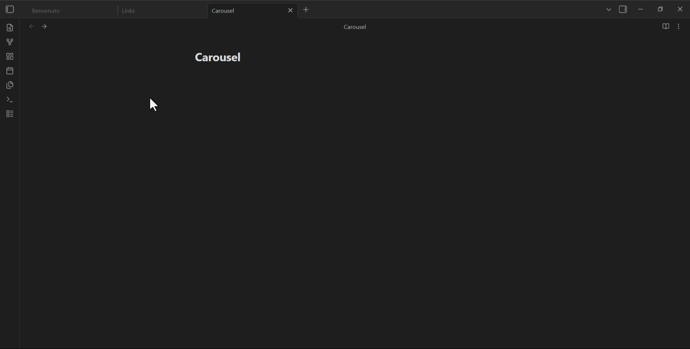

# Cards4Links

Paste URLs to generate beautiful card-styled links in Obsidian.

Turn any URL into a rich visual card with title, description, thumbnail, favicon, and host — directly in your editor. No more ugly raw links.

Visit my repo: https://github.com/Mats324/cards4links

## How to Use

### Method 1: Paste & Enhance command
Use the command palette → **"Paste URL and enhance to card link"**.

### Method 2: Paste a URL (auto-enhance)
Enable **"Enhance default paste"** in settings, then paste any URL normally.

### Method 3: Select & Enhance
Select a URL (or markdown link) and run **"Enhance selected URL to card link"** (`Ctrl+Shift+E`).

### Method 4: Right-click
Right-click in the editor → **"Paste URL and enhance to card link"**.

## Main Features

- **Paste & Enhance** — Paste a URL and instantly get a styled card
    - **Context Menu** — Right-click any URL to enhance it
- **Rich Metadata** — Auto-fetches Open Graph data (title, description, image)
- **Multiple Views** — Choose between Card, Compact, and Minimal layouts
- **Watched/Read Tracking** — Mark video cards as "Watched" and articles as "Read"
- **Carousel** — Combine multiple URLs into a scrollable card carousel (separate with `---` or select 2+ URLs)
- **Responsive** — Looks great on desktop and mobile
- **Card Theme** — Force light or dark card colors independently of Obsidian
- **Image Caching** — Download images to vault for offline access (TTL configurable)
- **Cache Cleanup** — Browse and delete cached images from a dedicated modal
- **Localized (EN/IT)** — Interface language follows Obsidian, with an optional manual override (Settings → Language)
- **Milestone Notifications** — Get useful tips as you create your 1st, 5th, 10th… card, plus a welcome notice on first activation
- **Card Counter** — Track how many cards you've created (visible in Settings, with a reset option)

### Specific Features
- **Image Placeholder** — Click a broken or missing thumbnail to set a custom image URL
- **Description Placeholder** — Click to add or edit the card description
- **Custom Thumbnails** — Display on the right, left, or hide entirely
- **Quick Settings** — `Ctrl+Shift+,` to open plugin settings directly

### Carousel
Select 2+ URLs and run **"Create carousel from selected URLs"** (`Ctrl+Shift+C`) to generate a scrollable card carousel.

## Views for a single card

| View | Description |
|------|-------------|
| Card | Full card with thumbnail, title, description, host |
| Compact | Smaller card, shorter description, smaller thumbnail |
| Minimal | No thumbnail, single-line description |

## Installation

### From Obsidian Community Store (pending)
1. Open Obsidian Settings → Community Plugins
2. Browse → Search "Cards4Links"
3. Install & Enable

### From GitHub (via BRAT)
1. Install the [BRAT](https://obsidian.md/plugins?id=obsidian42-brat) plugin
2. Add the repo: `Mats324/cards4links`
3. Enable Cards4Links

## Settings

| Setting | Description |
|---------|-------------|
| Language | Auto (follows Obsidian) / English / Italiano |
| Cards Created | Total cards generated since last reset (with Reset button) |
| Enhance Default Paste | Auto-fetch metadata when pasting a URL |
| Thumbnail Position | Right / Left / No thumbnail |
| Show Commands in Menu | Show in right-click context menu |
| Enable Watched/Read | Track watched/read status on cards |
| Default Card View | Default view: Card / Compact / Minimal |
| Card Theme | Default / Light / Dark |
| Cache Images Locally | Download card images to vault for offline access |
| Cache Storage | Global folder / Per note |
| Cache Folder Name | Folder path for cached images (global mode) |
| Cache TTL | How long before re-downloading (7–180 days / Never) |

## ❤️ Support

## License

GNU General Public License v3.0
